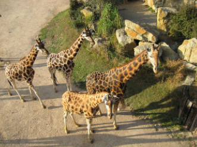

# Image Captioning

This topic demonstrates how to run the Image Caption sample application, which performs inference using image caption networks.

### Topology
The topology of this sample was forked from [pytorch-tutorial](https://github.com/yunjey/pytorch-tutorial) which wrote by yunjey.

### How It Works 

Upon the start-up, the sample application reads command line parameters and loads a network and an image to the Inference Engine plugin. When inference is done, the application creates an caption for input image.

### Models

Download the converted __encoder__ and __decoder__ model from [here](https://drive.google.com/file/d/1niJmVuYDY5MEPJ1ogsvplDrxC94MSDnX/view?usp=sharing) and save it on path `${PROJECT_ROOT}/models/`.

###Python

##### Usage

Using flags to assign the specific parameter:
```sh
-m_d            ->  assign the path of decoder model
-m_e            ->  assign the path of encoder model
-t_l            ->  assign the length of output text
-i              ->  assign the path of input image
--cpu_extension ->  assign the path of cpu extension library
```

##### Demo

Following the below commend to run the sample :
```sh
python infer.py -m_d ../models/decoder_nightly.xml -m_e ../models/encoder.xml -i ../images/example.png -t_l 20 --cpu_extension ${PATH_OF_CPU_EXTENSION_LIBRARY}
```

###C++

##### Compiler
```sh
mkdir build
cv build
cmake ..
make -j16
```

##### Usage

Using flags to assign the specific parameter:
```sh
-m_d            ->  assign the path of decoder model
-m_e            ->  assign the path of encoder model
-tl             ->  assign the length of output text
-i              ->  assign the path of input image
```

##### Demo

Following the below commend to run the sample :
```sh
./image_caption -m_d ../../models/decoder_nightly.xml -m_e ../../models/encoder.xml -i ../../images/example.png -t_l 20 
```

### Result

Inference image:



The caption for inference image:
__[<start> a group of giraffes standing next to each other . <end>]__
